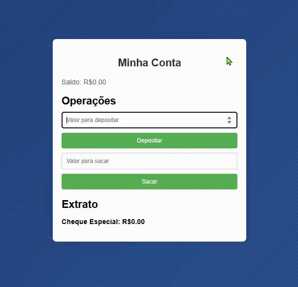

# **CΛVΛLIΞRE**

🏦 **Conta de Banco Simples**  
Este projeto simula uma conta bancária simples, permitindo que o usuário consulte o saldo, deposite e retire dinheiro. A aplicação foi construída utilizando HTML, CSS e JavaScript, com o objetivo de praticar a lógica de manipulação de valores e interatividade. Com uma interface limpa e intuitiva, o usuário pode interagir com a conta e visualizar as transações realizadas.

## ⚙️ Tecnologias Usadas
- **HTML**: Estruturação da página e dos elementos do formulário.
- **CSS**: Estilização da interface para proporcionar uma experiência visual agradável e responsiva.
- **JavaScript**: Lógica de manipulação da conta bancária, incluindo depósitos, retiradas e exibição do saldo.

## 🧠 Funcionalidades
- **Consultar Saldo**: O usuário pode verificar o saldo atual da conta.
- **Depósito**: É possível adicionar dinheiro à conta com a opção de definir o valor do depósito.
- **Retirada**: O usuário pode retirar um valor da conta, com checagem para garantir que o saldo seja suficiente.
- **Validação de Entradas**: O sistema valida as entradas para garantir que os valores inseridos sejam números válidos e positivos.
- **Feedback Visual**: Mensagens de confirmação e erro são exibidas para melhorar a experiência do usuário.
  
Link do projeto: <a href="https://conta-de-banco-simples-zeta.vercel.app/" target="_blank" rel="noopener noreferrer">
  Acessar Projeto
</a>
  
## 📸 GIF do Projeto


## 💡 Como Usar
Clone este repositório para o seu computador:

```bash
git clone https://github.com/seu-usuario/conta-banco-simples.git
